# GlanceThing

Your CarThing as a glanceable action pad!

> **About this fork:** this is a fork of [BluDood/GlanceThing](https://github.com/BluDood/GlanceThing) with a customizable screen layout, multiple pages, dial navigation, and new widgets for weather, calendar, AI usage and a photo album screensaver. See [What's new in this fork](#whats-new-in-this-fork) below.

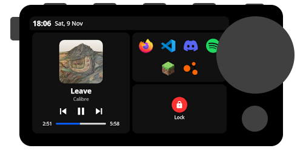

## Features

- Desktop companion app with a guided installer
- Status bar with date and time
- Spotify controls (play/pause, volume)
- Customizable shortcuts to apps
- Command actions, including Lock, Sleep and Wake

**Added in this fork:**

- Customizable screen layout with a live preview of the Car Thing screen
- Multiple pages you swipe between
- Dial navigation across pages, apps and shortcuts
- Weather widget
- Calendar widget with a Join button and meeting reminders (macOS)
- AI usage widget for Codex, Claude and Cursor subscriptions
- Photo album screensaver with up to 10 rotating photos
- More reliable adb device detection and reconnects
- Apps tray on the Car Thing, with built-in apps and community apps from GitHub

## What's new in this fork

### Screen layout with live preview

Build what the Car Thing shows from the **Layout** tab. Add frames for shortcuts, actions, playback and widgets, then drag and resize them on a preview that draws the real Car Thing screen, with the same icons, fonts and status bar. Changes save automatically and appear on the device straight away.

| Desktop app                                                 | Car Thing                                                       |
| ----------------------------------------------------------- | --------------------------------------------------------------- |
| 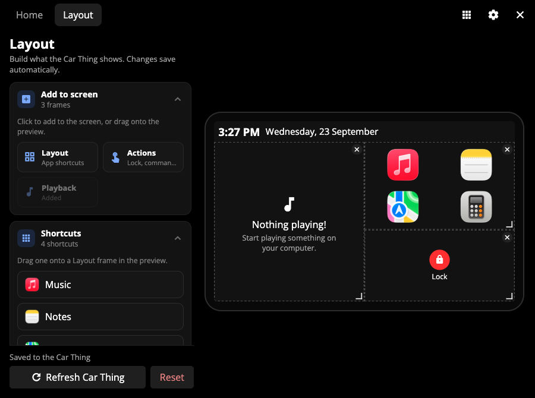 |  |

### Multiple pages

Each page has its own frames. Swipe left and right on the Car Thing to switch pages, and the dots at the bottom show which page you're on. In the editor, drag page tabs to reorder them, or press × to remove a page.

| Desktop app                                                       | Car Thing, page 2                                                     |
| ----------------------------------------------------------------- | --------------------------------------------------------------------- |
| 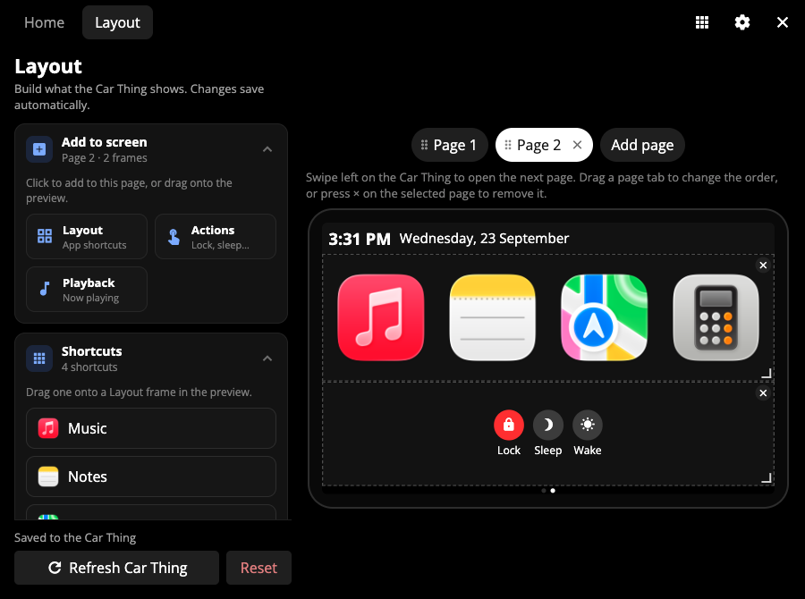 |  |

### Dial navigation

Turn the dial to move a highlight across the screen, and press it to open the shortcut or run the action. Under **Settings → General**, choose what the dial moves between:

- **Pages:** each step flips to the next page.
- **Apps & shortcuts:** moves through the items on the current page.
- **Both:** moves through the items, then continues onto the next page.

| Settings                                                      | Car Thing                                                            |
| ------------------------------------------------------------- | -------------------------------------------------------------------- |
| 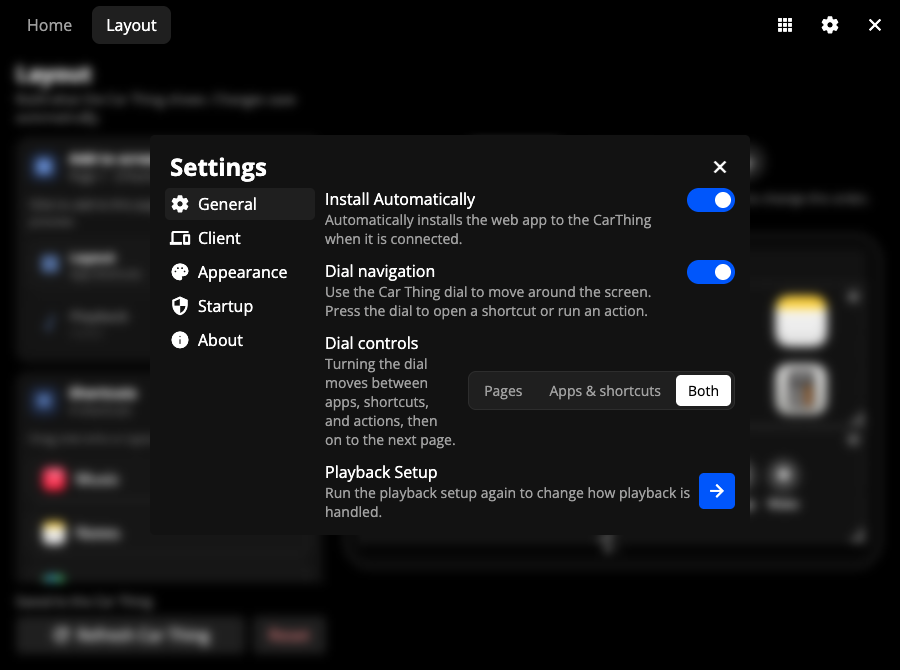 |  |

### Apps tray and community apps

Swipe down from the top of the Car Thing to open the apps tray. Built-in apps (Music, Pomodoro, Resource Usage, Recording Notes, GitHub, Console Logs, Link, Mic) live there.

On the desktop **Apps** tab you can pause or run those apps, and add more the same way DeskThing does: paste `owner/repo` or a GitHub URL, download the latest release zip, acknowledge any warnings, then **Initialize App**.

Official apps live in [GlanceThing-Apps](https://github.com/Pramodhsurya/GlanceThing-Apps). To **build** an app, or to see the exact files and `manifest.json` fields GlanceThing reads, see [APPS.md](APPS.md).

| Desktop Apps tab                                                          | Car Thing tray                                                     |
| ------------------------------------------------------------------------- | ------------------------------------------------------------------ |
|     |      |

| Music                                                              | Pomodoro                                                              |
| ------------------------------------------------------------------ | --------------------------------------------------------------------- |
|     |     |

| Resource Usage                                                     | Recording Notes                                                       |
| ------------------------------------------------------------------ | --------------------------------------------------------------------- |
|    |     |

| GitHub                                                             | Console Logs                                                          |
| ------------------------------------------------------------------ | --------------------------------------------------------------------- |
|    |         |

| Link                                                               | &nbsp;                                                                |
| ------------------------------------------------------------------ | --------------------------------------------------------------------- |
|      | &nbsp;                                                                |

### Sleep and wake actions

Two preset actions next to **Lock**. **Sleep** puts the computer to sleep, and **Wake** wakes its display.


### Weather

A weather frame with the current temperature, conditions, the day's high and low, and an hourly strip that includes sunrise and sunset. The layout adapts to the frame's size and shape.

| Desktop app                                                         | Car Thing                                                       |
| ------------------------------------------------------------------- | --------------------------------------------------------------- |
| 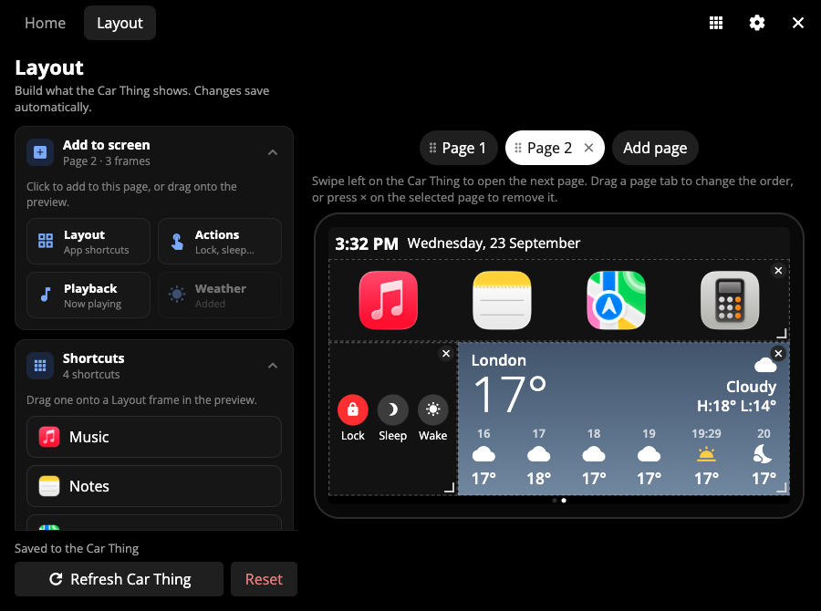 |  |

### Calendar and meeting reminders (macOS)

A calendar frame for today and tomorrow, read from **macOS Calendar**. It works with Exchange, Google, iCloud or any account added under System Settings → Internet Accounts. Online meetings get a **Join** button, and a reminder pops up on the Car Thing 15 minutes before each meeting with **Join**, **Snooze** and **Dismiss**.

| Desktop app                                                          | Car Thing                                                                | Reminder                                                                 |
| -------------------------------------------------------------------- | ------------------------------------------------------------------------ | ------------------------------------------------------------------------ |
| 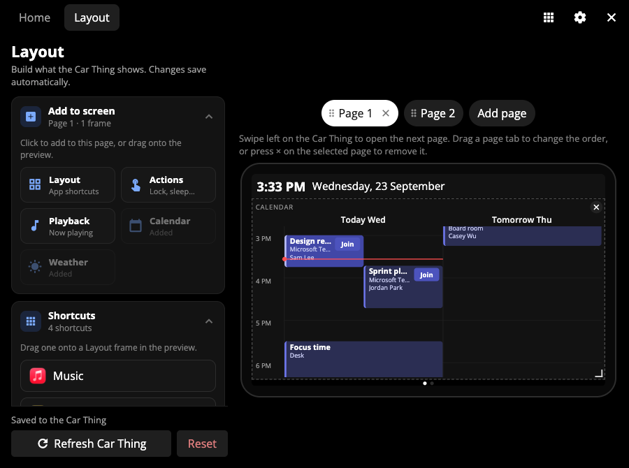 |  |  |

_(The meetings in these screenshots are demo data.)_

### AI usage

See how much of your **Codex**, **Claude** and **Cursor** subscription limits is left, when each limit resets, and how many tokens you used and what they cost today and over the last 30 days.

In the Layout tab, pick an overview style — **Cards + dial**, **Tinted cards**, **List rows**, **Rings** or **Compact** — or add one detail frame per subscription. The lowest limit leads in every layout; bars turn amber under 30% and red under 15%.

Usage is read with the sign-ins those apps already keep on your computer, so there's nothing new to sign in to. Requests are read-only, and it only refreshes while a usage frame is on the layout.

| Cards + dial overview                                                   | Two detail frames                                                     |
| ----------------------------------------------------------------------- | --------------------------------------------------------------------- |
|  |  |

| Single subscription (full)                                          | Layout editor — pick a style                                          |
| ------------------------------------------------------------------- | --------------------------------------------------------------------- |
|  |  |

### Photo album screensaver

Under **Settings → Client**, set **Sleep Method** to **Screensaver** and upload up to **10 photos**. When the Car Thing goes to sleep, the photos rotate every **30 seconds**, **1 minute** or **5 minutes** (**Photo Rotation**). Turn on **Shuffle Photos** for random order, and **Show Clock** for the time and date over the photos. Each thumbnail has a fill/fit control so tall photos can sit inside the screen instead of being cropped. Remove photos one at a time or clear the whole album. With no photos, the default animated screensaver is shown.

| Settings → Client                                                              | Car Thing screensaver                                                      |
| ------------------------------------------------------------------------------ | -------------------------------------------------------------------------- |
|  |  |

### Desktop app changes

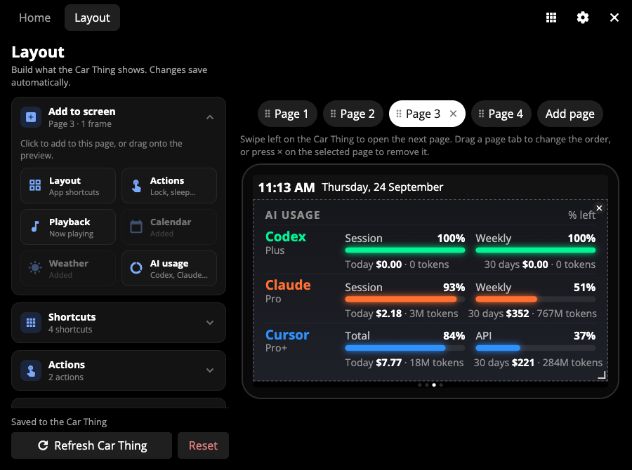

- **Home, Layout and Apps tabs:** the titlebar has **Layout** and **Apps** next to **Home**. Layout opens the editor. Apps lists built-in and community apps.
- **Layout editor sections:** the left side has collapsible sections, and the app remembers which ones you left open.
  - **Add to screen:** click a frame type, or drag it onto the preview.
  - **Shortcuts:** manage app shortcuts.
  - **Actions:** add your own actions with an icon, label and command, next to the Lock, Sleep and Wake presets.
  - **Calendar:** import events from macOS Calendar.
  - **Weather:** set the location and units, and refresh.
  - **AI usage:** pick an overview style (cards, tinted, list, rings or compact) or one frame per subscription, and refresh.
- **Preview:** drag and resize frames directly on the preview, and remove a frame with ×. Page tabs above the preview add, reorder and remove pages.
- **Saving:** changes are saved to the Car Thing automatically. **Refresh Car Thing** reloads the device, and **Reset** goes back to the default layout.
- **Settings → General:** new **Dial navigation** and **Dial controls** options.
- **Settings → Client:** **Photo Rotation**, shuffle, clock, and the photo album, with thumbnails, per-photo fill/fit and remove, and clear all.

| Settings → General                                                     | Settings → Client                                                         |
| ---------------------------------------------------------------------- | ------------------------------------------------------------------------- |
| 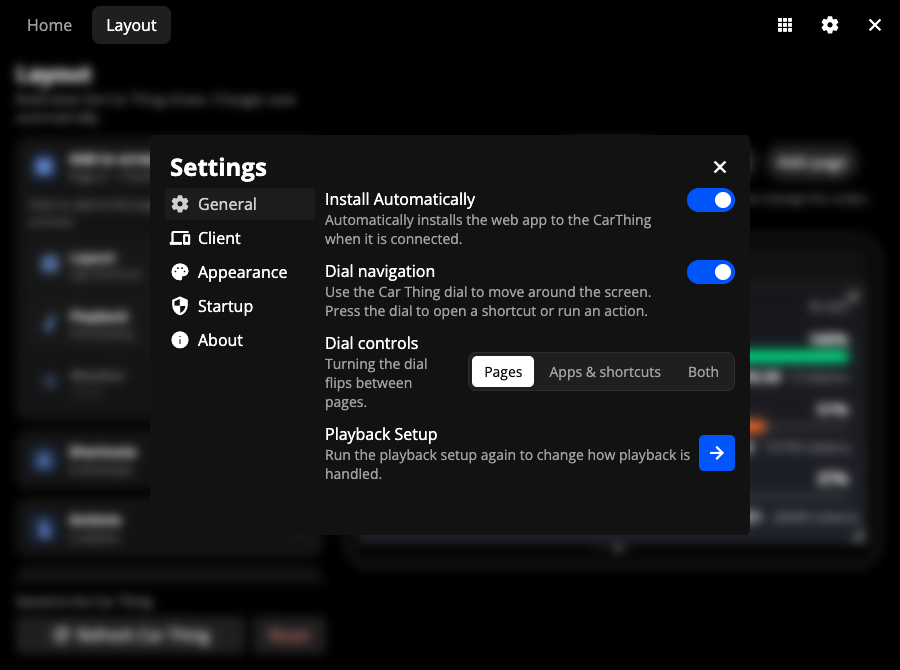 |  |

### Reliability

The desktop app handles unplugging, sleep and multiple adb devices better, and the client reconnects to the socket without looping.

## Getting started

The application only works on Windows and Mac for now. Linux support is planned! The calendar widget is macOS only.

This fork doesn't publish releases yet, so build it from source:

```bash
git clone https://github.com/Pramodhsurya/GlanceThing.git
cd GlanceThing
npm install
npm run build:mac   # or build:win

# build the Car Thing client and zip it
cd client
npm install
npm run build
cd dist && zip -r ../../glancething-client.zip . && cd ../..
```

1. Install the desktop app from the `dist` folder, open it and follow the instructions to set up your CarThing.
2. The packaged app downloads the original client by default. To use this fork's client, turn on **Developer Mode** in Settings, open the Developer Menu from the titlebar, choose **Install Custom** and select `glancething-client.zip`.

## Usage

### Client interface


Here you will see your current Spotify player status, as well as your app shortcuts and custom actions. You can use the touch screen, but the interface can also be fully navigated using the physical buttons, which is preferred.

The buttons 1, 2 and 3 (from the left) will focus the Spotify, shortcuts and actions widgets respectively.

Pressing the M button (right-most button) will bring up the system menu where you can choose to put your device to sleep, or restore your device to the original Spotify software.


Using the dial will:

- **Spotify widget**:
  - Click: Play/Pause playback.
  - Scroll: Adjust volume on the playing device

- **Shortcuts / Actions**:
  - Click: Execute highlighted action.
  - Scroll: Scroll between items, wraps around.

With a custom layout, the dial follows the **Dial navigation** setting described above.

You can also use the album cover as a playback controller. Press once to play/pause, twice to skip forward and three times to skip backwards.

Pressing the Back button (below the dial) reveals a fullscreen media player, which can be used with the same controls as the Spotify widgets, as well as extra tappable buttons like shuffle and repeat. Press the back button again or the arrow down icon to close.


### Desktop companion

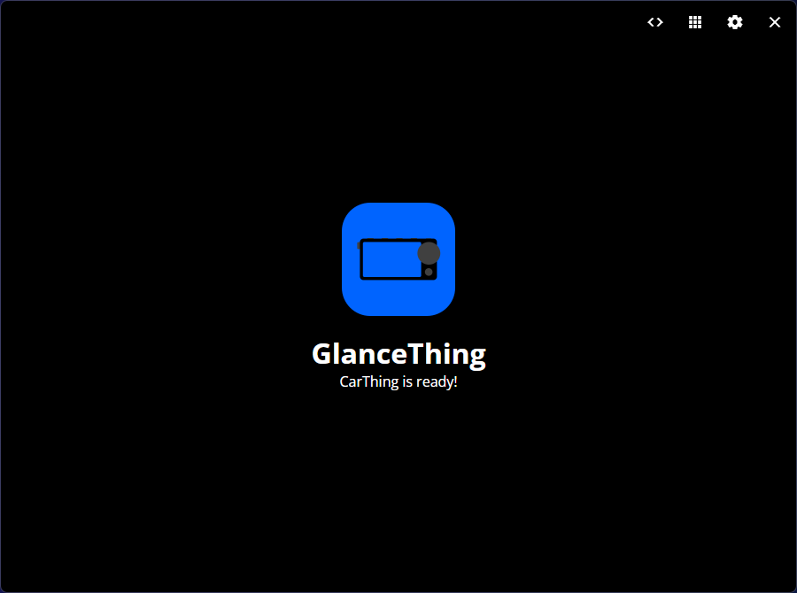

Here you will get status messages if your CarThing isn't detected, or if GlanceThing isn't installed. You can easily run setup again, or adjust settings to automatically install GlanceThing

### Shortcuts Editor

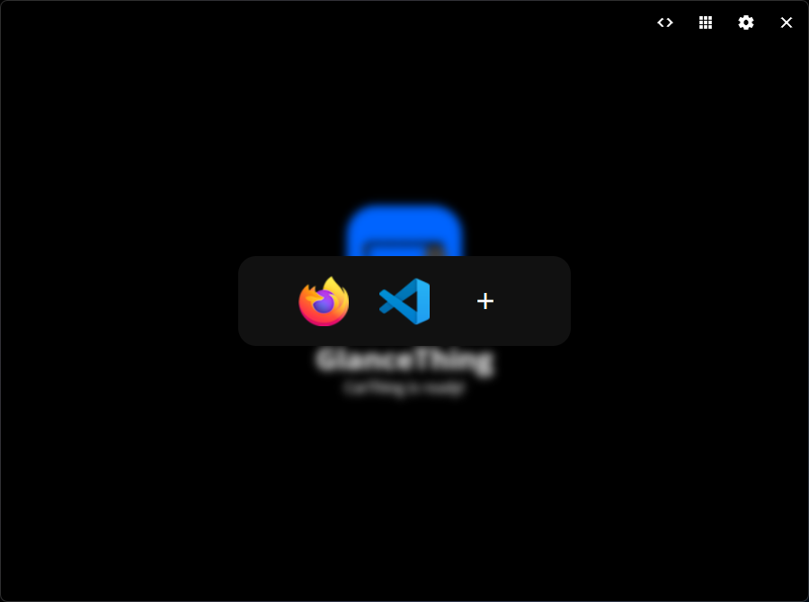

Here you can easily edit your application shortcuts, and visualize how they will look. You can add up to 8 shortcuts here, and you will be able to scroll through them on your CarThing.

You can add new shortcuts by clicking the + button, choosing an icon and selecting the command to run. [Here's how you can find the correct commands for any app.](https://github.com/BluDood/GlanceThing/wiki/Making-application-shortcuts)

### Settings

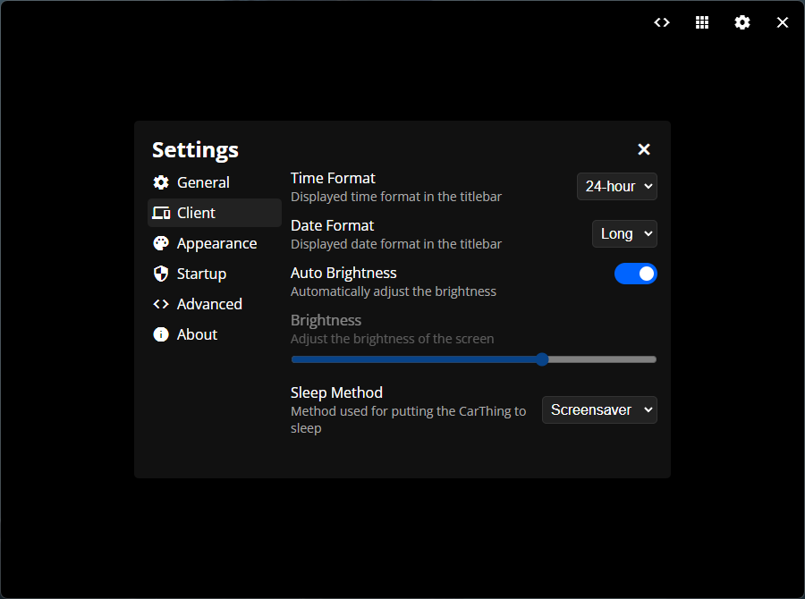

Here you can adjust how the app behaves. You can choose if the GlanceThing desktop companion will automatically start with your computer, whether it will start minimized to the system tray, and whether it will attempt to automatically install GlanceThing to your CarThing once it's detected. You can also adjust some settings that will reflect in the GlanceThing client, for example brightness, date/time format, dial navigation and the screensaver.

### Tray icon

GlanceThing will for the most part live in your system tray. Right-click it to bring up the menu, where you can open or quit GlanceThing. You can also just click the tray icon once to open GlanceThing.

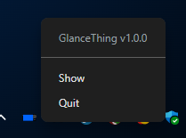

## Contributing

Contributions are very welcome! Make sure to follow the guidelines laid out in [CONTRIBUTING.md](CONTRIBUTING.md).

## Support

For problems with the features added in this fork, please [open an issue on this fork](../../issues). For help with GlanceThing or the CarThing in general, see the [original project](https://github.com/BluDood/GlanceThing), join [BluDood's discord server](https://discord.bludood.com) or the [Thing Labs discord server](https://discord.gg/car-thing-hax-community-1042954149786046604).

## Credits

GlanceThing was created by [BluDood](https://github.com/BluDood). This fork builds on their work.

Huge thanks to the [CarThing community](https://discord.gg/car-thing-hax-community-1042954149786046604) for feedback and thoughts, and special thanks to [Riprod](https://itsriprod.com/) and their [DeskThing](https://github.com/ItsRiprod/DeskThing) project for inspiration — including the swipe-down apps tray UX and app ideas such as Spotify, Local Audio, DeskThing-GMP, and Pomodoro. The built-in tray apps in this fork are GlanceThing-native implementations inspired by those experiences, not vendored copies of DeskThing app packages. The AI usage widget follows the approach of [CodexBar](https://github.com/steipete/CodexBar). On macOS, the "This computer" playback source uses [mediaremote-adapter](https://github.com/ungive/mediaremote-adapter) (BSD 3-Clause, bundled in `resources/common/mediaremote`), because macOS 15.4 and later block apps from reading Now Playing directly.

Most tray apps were written from scratch for GlanceThing after studying what these DeskThing apps do. **Pomodoro is the exception:** its timer is taken directly from [grahamplace/pomodoro-thing](https://github.com/grahamplace/pomodoro-thing) (original contribution by [grahamplace](https://github.com/grahamplace)).

| GlanceThing app                                                                               | Source                                                                            |
| --------------------------------------------------------------------------------------------- | --------------------------------------------------------------------------------- |
| Pomodoro (timer taken directly; focus blocks, short/long breaks, session dots, colours)       | [pomodoro-thing](https://github.com/grahamplace/pomodoro-thing) by grahamplace    |
| Music: full controls (seek, ±10 s, shuffle, repeat, volume)                                   | [DeskThing-GMP](https://github.com/RandomDebugGuy/DeskThing-GMP)                  |
| Music: source picker (use the computer's now-playing as the source)                           | [Local Audio](https://github.com/ItsRiprod/Deskthing-Apps/tree/main/audio)        |
| Resource Usage (CPU and RAM gauges, per-core load, history)                                   | [System](https://github.com/ItsRiprod/Deskthing-Apps/tree/main/system)            |
| Recording Notes (record voice notes with the Car Thing mic, saved on the computer)            | [Recording Notes](https://github.com/ItsRiprod/Deskthing-Apps/tree/main/recorder) |
| GitHub (repositories, starred, pull requests and issues)                                      | [DeskThing-GitHub](https://github.com/dakota-kallas/DeskThing-GitHub)             |
| Console Logs (live GlanceThing log with level and scope filters)                              | [Console Logs](https://github.com/ItsRiprod/Deskthing-Apps/tree/main/logs)        |
| Link (screens connected to the same computer share colours and tap scores)                    | [Link](https://github.com/ItsRiprod/Deskthing-Apps/tree/main/link)                |

If you contribute an app whose code or assets come **directly** from an existing repository, say so in the PR and credit the source — see [CONTRIBUTING.md](CONTRIBUTING.md#apps-from-existing-repositories).

The project also mainly utilizes the following technologies:

**Desktop Companion**

- Electron Vite toolkit
- TypeScript
- React TSX + React Router
- ws
- axios
- party.js

**Client**

- React + Vite
- axios
